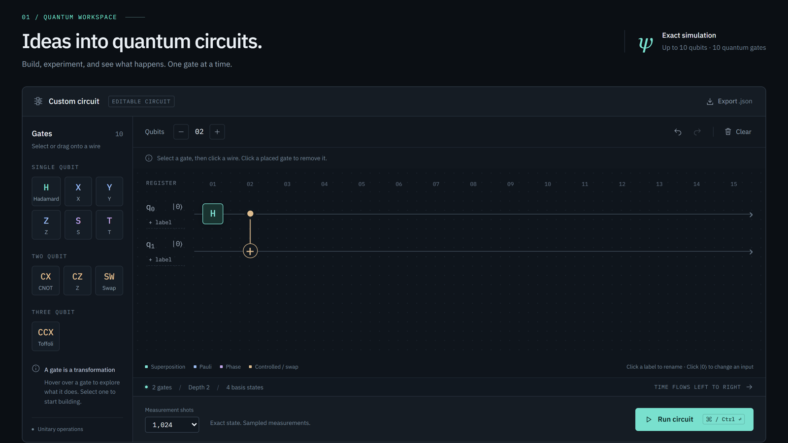
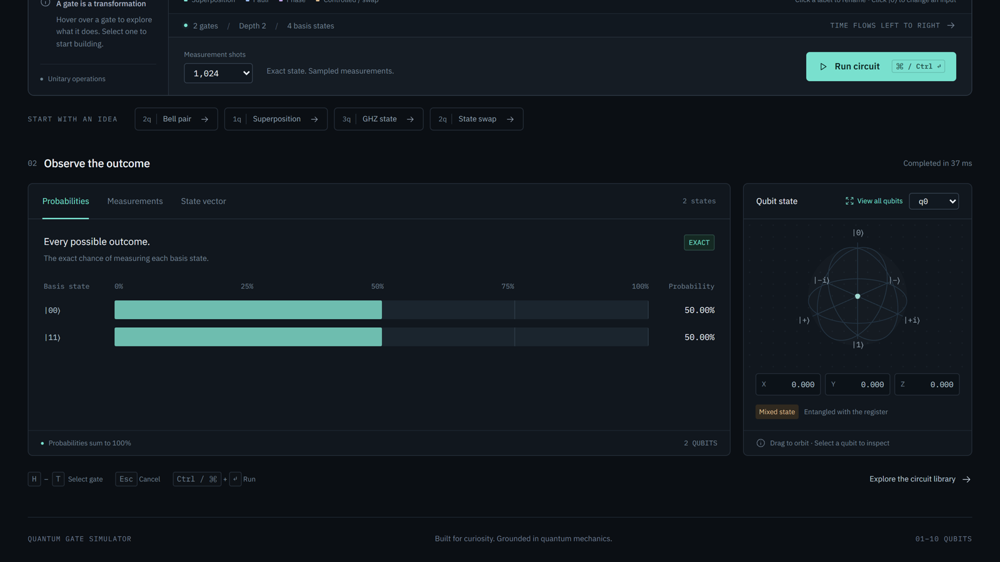
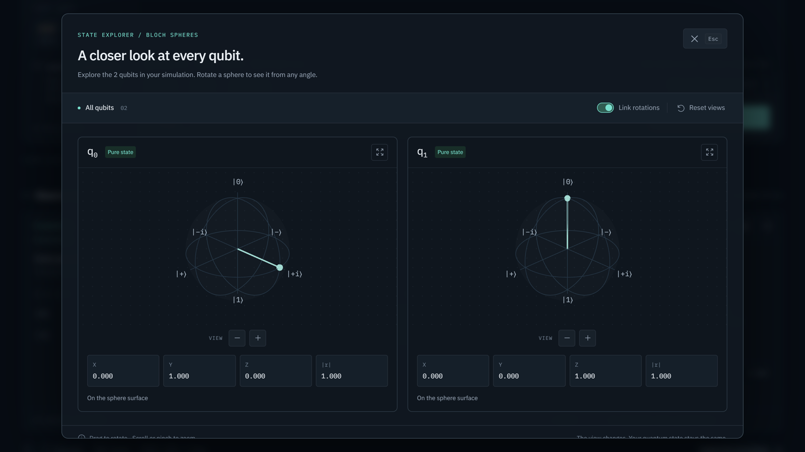
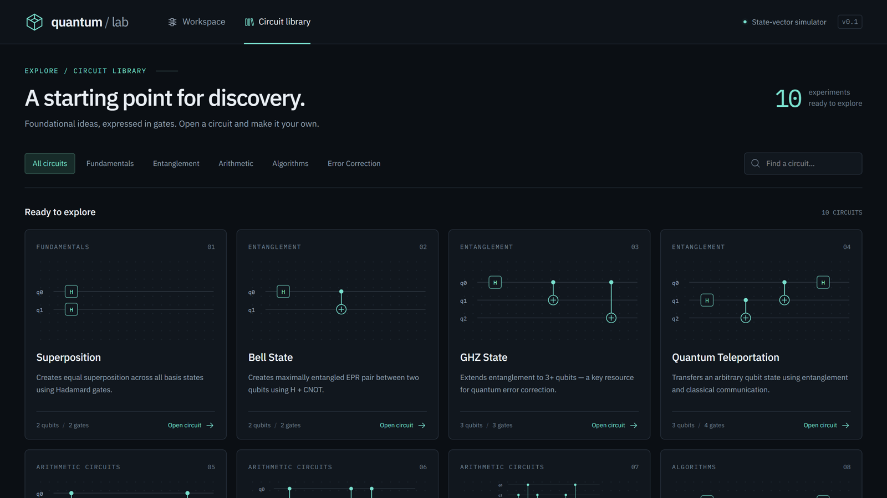

# Quantum Gate Simulator ⚛️

An interactive quantum circuit simulator (**quantum/lab**). Place gates on wires, run an exact state-vector simulation, and see the result as probabilities, sampled measurements, complex amplitudes and live 3D Bloch spheres.



## Features

- **Up to 10 qubits**: exact simulation with a pure Python/NumPy state-vector engine (up to a 1,024-dimensional Hilbert space).
- **10 gates**: `H`, `X`, `Y`, `Z`, `S`, `T`, `CNOT`, `CZ`, `SWAP` and the 3-qubit `CCNOT` (Toffoli).
- **Visual circuit builder**: select a gate and click a wire, or drag it onto the grid. Multi-qubit gates draw control → target connectors. Click a placed gate to remove it.
- **Custom inputs and labels**: click `|0⟩` to flip a qubit's initial state to `|1⟩`, and give any wire a label.
- **Undo / redo and export**: full edit history, plus export of the circuit as `.json`.
- **Results dashboard**:
  - **Probabilities**: the exact chance of each basis state.
  - **Measurements**: sampled counts (128 to 10,000 shots), with markers for the exact probabilities.
  - **State vector**: complex amplitudes, probabilities and relative phases.
- **3D Bloch spheres**: a per-qubit sphere built with React Three Fiber. It shows pure and mixed (entangled) states, and a full-screen explorer lets you rotate every qubit, with linked rotations.
- **Circuit library**: 10 ready-to-run circuits, each with a description and theory notes (see below).
- **Keyboard shortcuts**: `H`–`T` select a gate, `Esc` cancels, `Ctrl/⌘ + Enter` runs, `Ctrl/⌘ + Z` / `Y` undo and redo.

| Results | Bloch explorer |
| :---: | :---: |
|  |  |

## Circuit Library



| Category | Circuits |
| :--- | :--- |
| **Fundamentals** | Superposition |
| **Entanglement & Teleportation** | Bell State, GHZ State, Quantum Teleportation |
| **Arithmetic** | Half Adder, Full Adder, Quantum Multiplier (3 × 2 = 6 on 8 qubits) |
| **Algorithms** | Deutsch-Jozsa, Bernstein-Vazirani, Grover's Search |
| **Error Correction** *(planned)* | Bit-Flip Code, Phase-Flip Code |

The workspace also has quick starts for a Bell pair, Superposition, a GHZ state and a State swap.

## Tech Stack

| Component | Technology | Description |
| :--- | :--- | :--- |
| **Backend engine** | Python, FastAPI, NumPy | Tensor products, gate matrix application, Bloch vectors and measurement sampling. |
| **Frontend UI** | Next.js 16, React 19, TypeScript | Circuit builder, simulation controls, results dashboard and circuit library. |
| **Styling** | Tailwind CSS 4 | Custom dark "quantum" theme with IBM Plex Sans / Mono. |
| **3D rendering** | Three.js, React Three Fiber, Drei | Interactive Bloch spheres. |

---

## 🚀 Getting Started

Run the Python backend and the Next.js frontend at the same time, in two terminal windows.

### 1. Start the backend API

```bash
cd backend

# Create a virtual environment (first time only)
python -m venv venv

# Activate it
# Windows:
.\venv\Scripts\activate
# Mac/Linux:
source venv/bin/activate

# Install dependencies
pip install -r requirements.txt

# Run the FastAPI server
uvicorn main:app --reload --port 8000
```

The API runs at `http://localhost:8000`, with interactive docs at `http://localhost:8000/docs`.

### 2. Start the frontend

In a **new terminal window**:

```bash
cd frontend
npm install
npm run dev
```

Open [http://localhost:3000](http://localhost:3000) and start building circuits.

The frontend calls `http://localhost:8000` by default. To use a different backend, set `NEXT_PUBLIC_API_URL`.

### Running the tests

```bash
cd backend
pytest
```

The suite covers the engine, the API and the arithmetic and algorithm circuits.

---

## API

| Method | Endpoint | Description |
| :--- | :--- | :--- |
| `POST` | `/api/simulate` | Simulate a circuit: `num_qubits` (1–10), `initial_states`, `operations`, `shots` (1–10,000). Returns probabilities, measurement counts, the state vector and per-qubit Bloch vectors. |
| `GET` | `/api/gates` | List the supported gates. |

## Project Structure

```
backend/
  main.py                    FastAPI app and CORS setup
  simulation/engine.py       QuantumSimulator: state vector, gate application, Bloch vectors, sampling
  simulation/gates.py        Gate matrices
  simulation/router.py       /api/simulate and /api/gates
  simulation/schemas.py      Request / response models
  tests/                     Engine, API, arithmetic and algorithm tests
frontend/src/app/
  page.tsx                   Workspace
  circuits/                  Circuit library and per-circuit pages
  components/                Workbench, CircuitBuilder, GateToolbar, ResultDashboard, BlochSphere, BlochExplorer, …
  lib/                       Gate data, circuit library data, API client
```

## License

This is a personal project. Feel free to fork and experiment.
